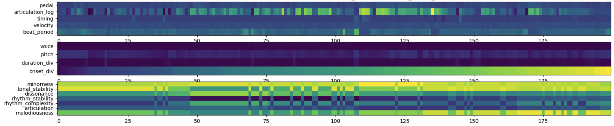

# DExter: Learning and Controlling Performance Expression with Diffusion Models

[]() [](https://colab.research.google.com/drive/1WAvdF3SOEIyy8qIQficFqfiRGOWBKd2?usp=sharing)


Code repository for DExter: a Diffusion-based Expressive performance generat(o)r, where we show samples of conditional and unconditioned rendering with perceptual-inspired features, as well as controlled ablation studies. The name also echos “dexterity”, one of the crucial qualities of human masters’ hands that enables the most fine-grained control over individual notes, which our models strive to achieve as well. 


# Table of Content
- [DExter: Learning and Controlling Performance Expression with Diffusion Models](#dexter-learning-and-controlling-performance-expression-with-diffusion-models)
- [Table of Content](#table-of-content)
- [Installation](#installation)
- [Rendering on custom score](#rendering-on-custom-score)
- [Training](#training)
  - [Dataset and Data processing](#dataset-and-data-processing)
  - [Precomputing codec](#precomputing-codec)
  - [Transfer pairing](#transfer-pairing)
  - [Supervised training with conditioning](#supervised-training-with-conditioning)
- [Testing](#testing)
- [Evaluation](#evaluation)


# Installation
This repo is developed using `python==3.9.7`, so it is recommended to use `python>=3.9.7`.

To install all dependencies
```
pip install -r requirements.txt
```
Partitura versioning: This project use a slightly modified version of performance codec, and please install [my fork of partitura](https://github.com/anusfoil/partitura/tree/diffperformer_codec) where this branch is dedicated to this project. 

# Rendering on custom score

Inference on custom score can be done either in commandline or in the [Colab notebook](https://colab.research.google.com/drive/1WAvdF3SOEIyy8qIQficFqfiRGOWBKd2?usp=sharing). Note that, current inference script only support the mid-level-condition-free (i.e. only use the given score as conditioning) since mid-level features are only obtained for our dataset with audio tracks. Rendering with inferred mid-level features will come soon. 
```
python inference.py score_path="/path/to/your/musicxml" pretrained_path='/path/to/checkpoint' output_path='/your/output/path'
```


# Training

## Dataset and Data processing

Three score-performance aligned datasets are used in this project:
* ATEPP: https://github.com/BetsyTang/ATEPP 
  * The above link doesn't contain score-performance aligned match file. Download dataset with [parangonar](https://github.com/sildater/parangonar) alignment computed: https://drive.google.com/file/d/1YsZC_uvaOomIUW0RxqkB_8DNFQlkVl-A/
* ASAP: https://github.com/CPJKU/asap-dataset 
* VIENNA422: https://github.com/CPJKU/vienna4x22 

## Precomputing codec

The following script converts the scores and performances in the datasets into performance codec ```p_codec``` and score codec ```s_codec```. Output will be saved in ```data/```. Notice that different ```MAX_NOTE_SEQ``` will lead to different truncation of ```snote_ids``` and saved separately. 

```
python prepare_data.py --compute_codec --MAX_NOTE_SEQ=100 --mixup
```
- ```MAX_NOTE_LEN```: The length of note sequence to split.
- ```BASE_DIR```: base directory to save the output. The output would be saved as ```BASE_DIR/codec_N={max_note_len}.npy```
- ```mixup```: whether mixup augmentation is used. Our mixup strategy takes every pair of interpretations and average the p_codec. This roughly scales the amount of data by 10 times. 

For pre-computed codec, please [download](https://drive.google.com/file/d/1o91jYxOMsbXZZvfE7Z_8hM6DJbXixoXb/view?usp=sharing) and unzip. It contains the codec and snote_ids of ```MAX_NOTE_LEN=100, 300, 1000```. 

Before training, put the pre-computed codec in ```data``` under the root folder. However, for testing and output decoded performance, you will need the originl score XML from the 3 datasets. Please download them and put them under ```Dataset``` in the same level as root folder (we need the score to decode performance). 



The ```c_codec```, derived from the mid-level perceptual features proposed in [this paper](), captures the perceptual expressiveness of the audio data and can be used for conditioning. The c_codec is precomputed for all audio data for the set we used. 

## Transfer pairing

For transfer training or inference, we need to pair up two performances from the same piece. The computation goes through all precomputed codec and find the ones that belongs to the same composition and same segment, and create pairs. Depending on the number of pairs requested (K), the function return two lists, paired and unpaired data. 
Note that mixuped interpolation data is of course not included in the pairing as they are not real performances, instead they go into the unpaired list.

```
python prepare_data.py --pairing  --K=2374872
```
- ```K```:  The number of pairs to generate. For the most 2374872 pairs can be found (segment level).  
- ```BASE_DIR```: base directory to save the output. The output would be two numpy list saved as ```BASE_DIR/codec_N={N}_mixup_paired_K={K}.npy``` and ```BASE_DIR/codec_N={N}_mixup_unpaired_K={K}.npy``` 


## Supervised training with conditioning

```
python train.py gpus=[0] task.timestep=1000 --train_target='gen_noise'
```

- `gpus` sets which GPU to use. `gpus=[k]` means `device='cuda:k'`, `gpus=2` means [DistributedDataParallel](https://pytorch.org/docs/stable/generated/torch.nn.parallel.DistributedDataParallel.html) (DDP) is used with two GPUs.
- `timesteps` set the number of denoising timesteps.
- For a full list of parameters please refer to `train.yaml` and `task/classifierfree_diffusion.yaml`
- ```train_target```: 'gen_noise' or 'transfer'. 'gen_noise' works within the diffusion framework and sample ```p_codec``` from N(0, 1). However transfer is a diffusion-like strategy (as the Gaussian distribution assumption is gone) that goes from one interpretation to another conditioned on the perceptual features (inspired from [this paper]()). Note that these two different training features different use of: 1. data: The former can be trained on individual data but the later has to use pair in training. 2. ```c_codec```: In the former c_codec is used as a standalone condition, but in the later the ```c_codec``` is conditioned as the difference between two interpretations (tgt-src), acting as a notch. 

The checkpoints will be output to `artifacts/checkpoint/`


# Testing 

First, open `config/train.yaml`, and then specify the weight to use in `pretrained_path`, for example `pretrained_path='artifacts/checkpoint/len300-beta0.02-steps1500-x_0-L15-C512-cfdg_ddpm_x0-w=0-p=0.1-k=3-dia=2-4/1244e-diffusion_loss0.03.ckpt'`. Or you can specify in the command line.

<!-- You can download pretrained weights from [Zenodo](https://zenodo.org/record/7246522#.Y2tXoi0RphE). After downloading, put them inside the folder `weights`. -->

```
python train.py gpus=[0] test_only=True load_trained=True task.transfer=True task.sample_steps_frac=0.75
```

- `test.transfer` sets the task to transfer from a . Currently only supports the paired testing set. 
- `test.sample_steps_frac` is the depth of steps to noisify the source performance and respectively the steps to denoise sampling. 

During testing, the following will be generated / evaluated: 
- Sampling the testing set data.
- Render the samples. Output into `artifacts/samples/`
- Animation of the predicted p_codec from noise
- Tempo curve and velocity curve. If `WANDB_DISALBED=False` this will be uploaded to the wandb workspace. 
- Comparison between the pred p_codec and label p_codec.


# Evaluation

For the full list of assessed attributes please refer to the [performance features](https://github.com/CPJKU/partitura/blob/performance_expressions/partitura/musicanalysis/performance_features.py). 

```
python train.py gpus=[0] --renderer='gen_noise'
```

- `renderer` is the renderer selected, can be external renderer for comparison.
- For a full list of parameters please refer to `evaluate.yaml`.

